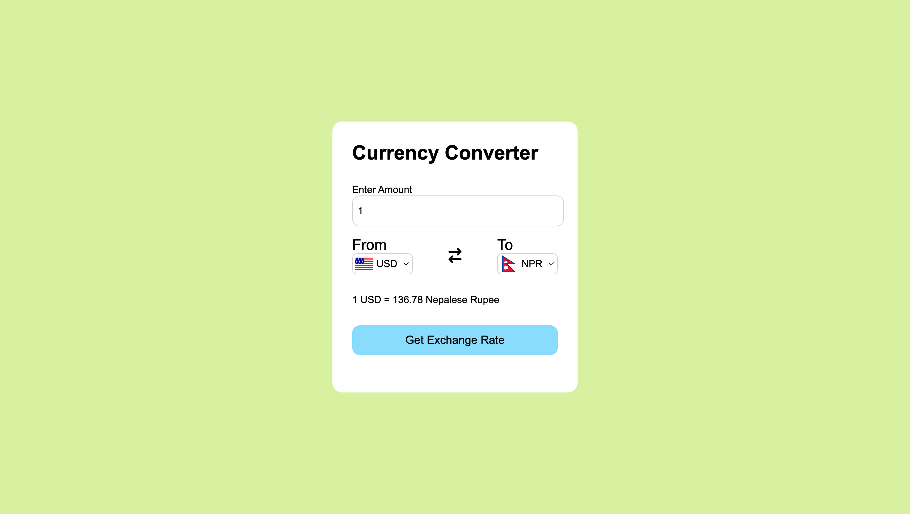

# Currency Converter
- Developed a real-time currency conversion application using JavaScript, APIs, and modern web technologies, enabling users to convert between multiple international currencies with an intuitive interface.
- Implemented integration with external APIs (currency-api and flagsapi) to fetch live exchange rates and country flags, enhancing the user experience with visual representations of selected currencies.

Image of the project

